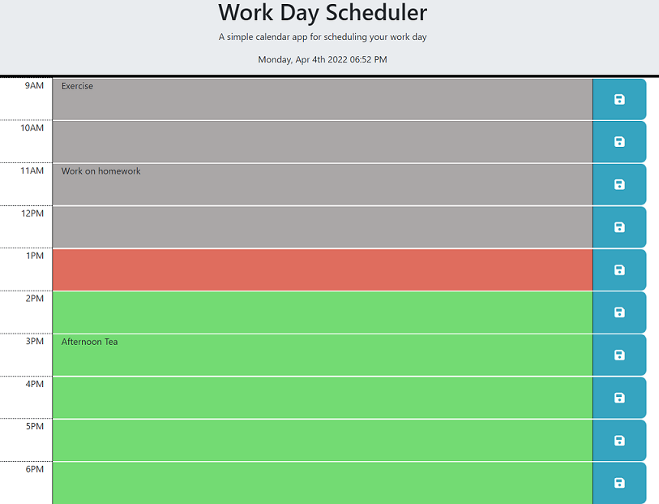

# Work Day Calendar Application

## Description

This web application is a simple scheduler. It allows you to schedule tasks by each hour of the day. These tasks remain in local storage and will continue to display if the page is refreshed.

The application also color codes the time of day.  This displays the current time, past time, and future time.

The page uses several third party APIs including:

- Bootstrap for the UI layout
- Font awesome for the save button icons
- jQuery for the javascript
- Moment.js for time information

## Table of Contents

- [Screenshots and Links](#screenshots)
- [Acceptance Criteria](#acceptance)
- [What I Learned](#learned)

## ScreenShots

Below is a screen shot of the web application:

The page is live on [GitHub Pages](https://stephencurrie.github.io/hw-5-day-planner/)

The code is in the [GitHub Repository](https://github.com/stephencurrie/hw-5-day-planner)

## Acceptance

The following were the acceptance criteria for the ticket:

- [x] When I open the planner, the current day and time is displayed
- [x] When I scroll down, I am presented with timeblocks for standard business hours
- [x] When I view the timeblocks, the background color indicates whether the time is in the past, present, or future
- [x] When I click into a timeblock, I can enter an event
- [x] When I click the save button for that time block, the text is save in local storage
- [x] When I refresh the page, the saved events persist

## Learned

The following is a list of things I learned:

- How to link to and use third party API's such as jQuery and Bootstrap
- How to use bootstrap to layout rows and columns
- How to use jQuery:
  - use of $ instead of using event listeners
  - "each" loop and "this" variable to cycle through a list
  - ability to dynamically create classes in the HTML
  - navigate the dom
- How to use Moment.js to format and display time information
